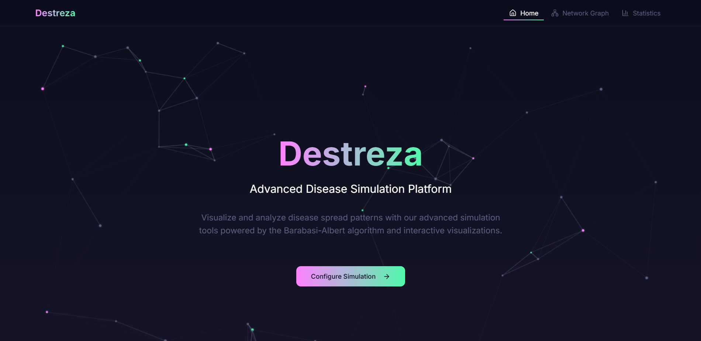
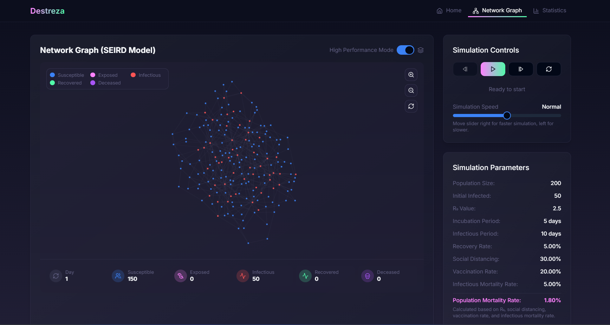
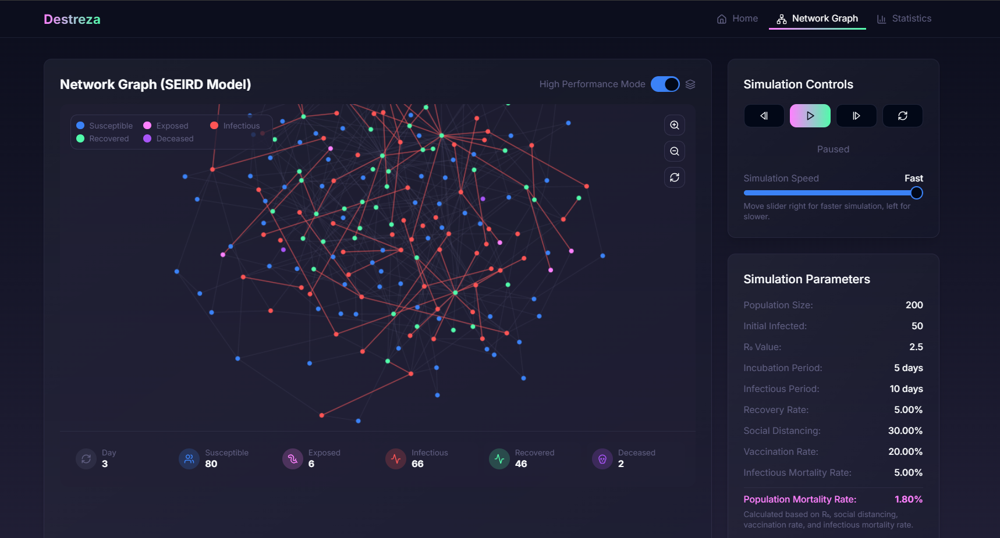
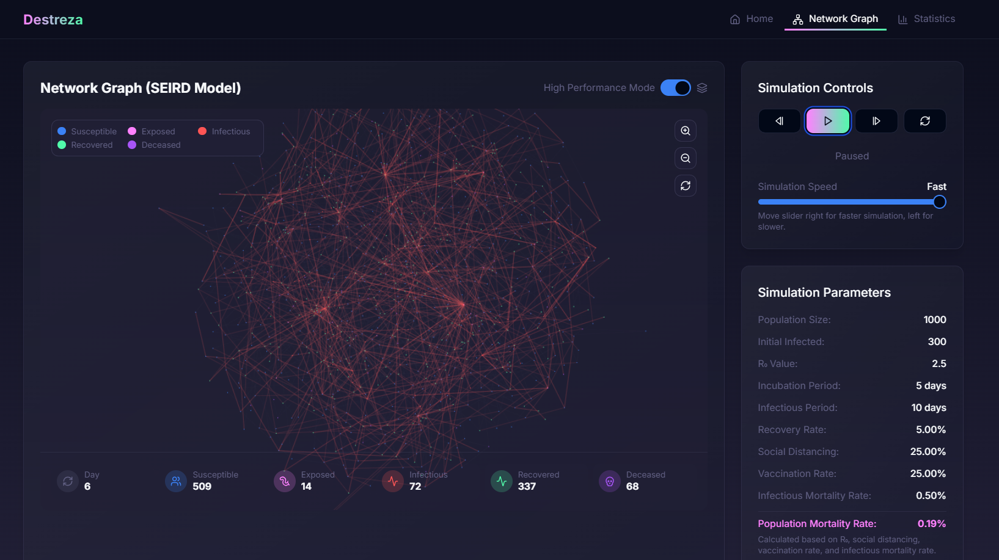

# Destreza: An Advanced Disease Simulation Platform

Destreza is an interactive web-based platform designed to simulate the spread of diseases using a hybrid SEIRD/S (Susceptible, Exposed, Infectious, Recovered, Deceased/Susceptible) compartmental model on a Barabási-Albert scale-free network.

This project allows users to adjust epidemiological parameters and visualize disease progression in real-time through an interactive force-directed graph. Leveraging modern web technologies, Destreza offers high performance and scalability, making it ideal for simulating moderately sized populations ranging from 100 to 2,500 nodes.



## Presentation

Explore the full project details in the official Beamer presentation:  
[View/Download Presentation](docs/Destreza_Presentation.pdf)

## Features

- **Interactive Parameter Adjustments**: Allows real-time tweaking of parameters such as R₀ (0.1–10), vaccination rates (0–1), and social distancing (0–1).


- **Hybrid SEIRD/S Disease Model**: Uses a hybrid of SEIRD and SIRS models by allowing a Recovered individual to either become re-Susceptible or Deceased based on carefully calculated probabilities. Simulates disease dynamics with five compartments, incorporating incubation periods, recovery rates, and mortality.
- **Custom Barabási-Albert Network Generation**: Implements an optimized Fenwick Tree algorithm for efficient preferential attachment, enabling simulations of large-scale networks in O(N log N) time.
- **Force-Directed Graph Layout**: Uses D3.js for SVG rendering or Web Workers for computation offloading, ensuring smooth performance.







- **Real-Time Statistics**: Displays current counts of susceptible, exposed, infectious, recovered, and deceased individuals, alongside historical data.


- **SVG and Canvas Rendering**: Supports SVG for detailed visualizations and Canvas for high-performance rendering of large networks.
- **Zoom, Pan, and Rotation Controls**: Provides an interactive interface to explore the network.
- **High-Performance Mode**: Optimized for simulating thousands of nodes with minimal lag.

## Installation

To run Destreza locally, follow these steps:

1. **Clone the Repository**:
   ```bash
   git clone https://github.com/yourusername/destreza.git
   cd destreza
   ```

2. **Install Dependencies**:
   ```bash
   pnpm install
   ```

3. **Run the Development Server**:
   ```bash
   pnpm run dev
   ```

4. **Open the Application**:
   Navigate to `http://localhost:3000` in your web browser.

*Note*: Ensure you have Node.js and pnpm installed on your system.

## Usage

Once the application is running:

- **Adjust Parameters**: Use the control panel’s sliders and inputs to set population size (100–2,500), initial infected, R₀, recovery rate (0.01–0.5), mortality rate (0.001–0.1), incubation period (1–30 days), vaccination rate, and social distancing factor.
- **Start Simulation**: Click "Play" to begin. Pause, step forward, or reset the simulation as needed.
- **Observe the Network**: Watch the disease spread across the network, with nodes changing color based on their state (e.g., susceptible, infectious).
- **Analyze Statistics**: Monitor real-time counts and historical trends via charts and data panels.
- **Switch Rendering Mode**: Toggle between SVG and Canvas to optimize performance for your network size.

*Note*: For +500 nodes, enabling High Performance mode is recommended for a smooth experience. After enabling High Performance Mode, press the Reset button once to ensure the disease progression animation for the network configures correctly.

## Technologies Used

| **Layer**         | **Technologies**                  |
| ----------------- | --------------------------------- |
| **Languages**     | TypeScript, JavaScript, CSS       |
| **Frontend**      | React, Next.js, Tailwind CSS      |
| **UI Components** | Radix UI, Lucide, Embla Carousel  |
| **Visualization** | D3.js, Three.js, Recharts, GPU.js |
| **State/Forms**   | react-hook-form, zod              |
| **Utilities**     | Lodash, clsx, tailwind-merge      |
| **Build Tools**   | pnpm, PostCSS, TypeScript, ESLint |
| **Notifications** | sonner                            |
| **Date Utils**    | date-fns                          |

## Contributing

Destreza is a student project developed for educational purposes as part of a Design and Analysis of Algorithms course. To report issues or suggest improvements, please open an issue on the [GitHub repository](https://github.com/Sys-Omertosa/Destreza_Disease_Simulator). Contributions are welcome!

## License

This project is licensed under the MIT License. See the [LICENSE](LICENSE) file for details.

## Contact

For questions or feedback, reach out to [Ahmad Shahmeer](https://github.com/Sys-Omertosa).
